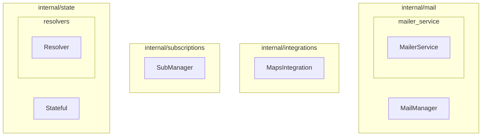

# Weather Subscriptions

## Overview

Weather Subscriptions is a Go-based application that allows users to subscribe to weather updates for specific locations. The application periodically fetches weather information and sends out email notifications to subscribed users. It provides an API for managing subscriptions and retrieving weather data.

The application uses a PostgreSQL database to store user and subscription data, and integrates with Google Maps API for geocoding and weather information. Email notifications are handled via an SMTP mailer service. Scheduled tasks for sending hourly and daily updates are managed using `gocron`.

## Features

- User subscriptions for weather updates.
- Hourly and daily weather email notifications.
- API for managing subscriptions (create, view, delete).
- Integration with Google Maps API for location and weather data.
- Configurable email service (SMTP).
- Scheduled jobs for automated email dispatch.
- Dockerized setup for easy deployment.

## Getting Started

### Prerequisites

- [Go](https://golang.org/doc/install) (version 1.24.2 or higher)
- [Docker](https://docs.docker.com/get-docker/) and [Docker Compose](https://docs.docker.com/compose/install/)

### Installation & Running

The primary way to run the application is using Docker Compose.

1.  **Clone the repository:**
    ```bash
    git clone https://github.com/vanyatemno/weather-subscriptions
    cd weather-subscriptions
    ```

2.  **Environment Configuration:**
    Create a `.env` file in the root directory by copying `.env.example` (if one exists) or by creating it from scratch. This file should contain the necessary environment variables as defined in `internal/config/config.go` and used by `docker-compose.yml`.
    Key variables include:
    *   `DNS`: Domain Name System configuration.
    *   `DATABASE_NAME`, `DATABASE_HOST`, `DATABASE_USER`, `DATABASE_PASSWORD`: PostgreSQL connection details.
    *   `PORT`: Port for the web server (default: 3000).
    *   `GOOGLE_MAPS_API_KEY`: API key for Google Maps services.
    *   `MAILER_HOST`, `MAILER_PORT`, `MAILER_USERNAME`, `MAILER_FROM`, `MAILER_SMTP`, `MAILER_PASSWORD`: SMTP mailer configuration.

    Ensure the `deploy/docker/postgres/database.env` file is also configured correctly for the PostgreSQL service.

3.  **Build and Run with Docker Compose:**
    The `Makefile` provides a convenient command to build and start the services:
    ```bash
    make build
    ```
    This command executes `docker compose up --build`.

    Alternatively, you can run directly:
    ```bash
    docker compose up --build -d
    ```
    The application will be accessible at `http://localhost:3000` (or the port specified in your `.env` file).

### Running Locally (without Docker)

1.  **Install dependencies:**
    ```bash
    make dep
    # or
    go mod tidy
    go mod download
    ```

2.  **Set up a PostgreSQL database** and configure the connection details in your `.env` file.

3.  **Run the application:**
    ```bash
    go run cmd/main.go
    ```

## Configuration

The application is configured through environment variables, which are loaded via a `.env` file at the root of the project and defined in `internal/config/config.go`.

Key configuration options:

*   **`DNS`**: Application's DNS.
*   **`DATABASE`**:
    *   `NAME`: Database name.
    *   `HOST`: Database host.
    *   `USER`: Database user.
    *   `PASSWORD`: Database password.
*   **`PORT`**: Port for the HTTP server (default: `3000`).
*   **`GOOGLE_MAPS_API_KEY`**: API key for Google Maps.
*   **`WEATHER_TIME_ROUND_OFF`**: Time rounding for weather data (default: `10` minutes).
*   **`MAILER`**:
    *   `HOST`: SMTP server host.
    *   `PORT`: SMTP server port.
    *   `USERNAME`: SMTP username.
    *   `FROM`: Sender email address.
    *   `SMTP`: SMTP server address.
    *   `PASSWORD`: SMTP password.

Refer to `internal/config/config.go` for the complete structure and `internal/config/load.go` for how they are loaded.

## API Endpoints

The API routes are defined in `api/routes/routes.go`. Below is a summary of the available endpoints based on the `docs/swagger.yaml` specification.

### Weather Operations

#### GET /weather
*   **Summary:** Get current weather for a city.
*   **Description:** Returns the current weather forecast for the specified city using WeatherAPI.com.
*   **Parameters:**
    *   `city` (query, string, required): City name for weather forecast.
*   **Responses:**
    *   `200 OK`: Successful operation - current weather forecast returned.
        *   Payload: `{ "temperature": number, "humidity": number, "description": string }`
    *   `400 Bad Request`: Invalid request.
    *   `404 Not Found`: City not found.

### Subscription Operations

#### POST /subscribe
*   **Summary:** Subscribe to weather updates.
*   **Description:** Subscribe an email to receive weather updates for a specific city with chosen frequency.
*   **Parameters (form data):**
    *   `email` (string, required): Email address to subscribe.
    *   `city` (string, required): City for weather updates.
    *   `frequency` (string, required, enum: ["hourly", "daily"]): Frequency of updates.
*   **Responses:**
    *   `200 OK`: Subscription successful. Confirmation email sent.
    *   `400 Bad Request`: Invalid input.
    *   `409 Conflict`: Email already subscribed.

#### GET /confirm/{token}
*   **Summary:** Confirm email subscription.
*   **Description:** Confirms a subscription using the token sent in the confirmation email.
*   **Parameters:**
    *   `token` (path, string, required): Confirmation token.
*   **Responses:**
    *   `200 OK`: Subscription confirmed successfully.
    *   `400 Bad Request`: Invalid token.
    *   `404 Not Found`: Token not found.

#### GET /unsubscribe/{token}
*   **Summary:** Unsubscribe from weather updates.
*   **Description:** Unsubscribes an email from weather updates using the token sent in emails.
*   **Parameters:**
    *   `token` (path, string, required): Unsubscribe token.
*   **Responses:**
    *   `200 OK`: Unsubscribed successfully.
    *   `400 Bad Request`: Invalid token.
    *   `404 Not Found`: Token not found.

For a fully detailed API specification, please refer to the Swagger documentation: `docs/swagger.yaml`. You can use tools like Swagger Editor or Swagger UI to view and interact with it.

## Project Structure

```
.
├── api/                  # API handlers and routes
│   ├── handlers/         # Request handlers for different resources
│   └── routes/           # API route definitions
├── cmd/                  # Main application entry point
│   └── main.go
├── deploy/               # Deployment configurations
│   └── docker/           # Docker-specific files (Dockerfile, env files)
├── docs/                 # API documentation (e.g., Swagger)
│   └── swagger.yaml
├── internal/             # Internal application logic
│   ├── config/           # Configuration loading and structures
│   ├── db/               # Database connection and models
│   ├── integrations/     # Third-party API integrations (e.g., Google Maps)
│   ├── mail/             # Email sending logic and services
│   ├── state/            # Application state management
│   ├── subscriptions/    # Subscription management logic
│   └── templates/        # Email templates
├── .env.example          # Example environment file (if provided)
├── .gitignore
├── docker-compose.yml    # Docker Compose configuration
├── go.mod                # Go module dependencies
├── go.sum
├── Makefile              # Make commands for build, lint, etc.
└── README.md             # This file
```

## Internal Interfaces

This section outlines the key interfaces defined within the `internal/` directory of the project. These interfaces define contracts for various services and components.

- **`MailManager`** (defined in `internal/mail/manager.go`): Manages the sending of mail, specifically for hourly notifications.
- **`MapsIntegration`** (defined in `internal/integrations/integrations.go`): Provides an abstraction for map-related services, such as fetching weather data for a city.
- **`SubManager`** (defined in `internal/subscriptions/manager.go`): Handles subscription-related operations, including sending confirmation emails.
- **`Stateful`** (defined in `internal/state/state.go`): Represents a component that can manage and retrieve stateful data, like user information.
- **`Resolver`** (defined in `internal/state/resolvers/db.go`): Specifically resolves data from a database, such as fetching a user by ID.
- **`MailerService`** (defined in `internal/mail/mailer_service/mailer.go`): A more generic service for sending mail messages.

### Interface Diagram



## Available Scripts (Makefile)

*   **`make lint`**: Runs the Go linter (`golangci-lint`) to check code quality. Requires `check-lint` and `dep` targets.
*   **`make dep`**: Tidies and downloads Go module dependencies.

## Contributing

Please feel free to submit issues and pull requests.

